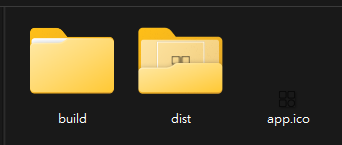
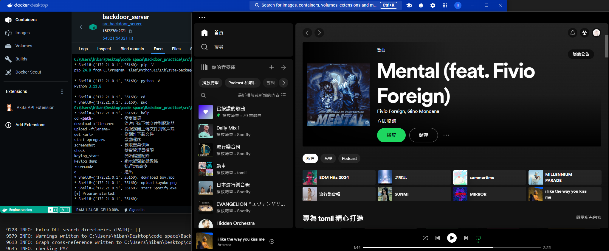

<!--
 * @Author: hibana2077 hibana2077@gmail.com
 * @Date: 2024-06-05 20:04:14
 * @LastEditors: hibana2077 hibana2077@gmail.com
 * @LastEditTime: 2024-06-14 18:35:34
 * @FilePath: \Backdoor_practice\README.md
 * @Description: 这是默认设置,请设置`customMade`, 打开koroFileHeader查看配置 进行设置: https://github.com/OBKoro1/koro1FileHeader/wiki/%E9%85%8D%E7%BD%AE
-->
# Backdoor practice

> [!NOTE]
> Please be advised that the code in this repository is intended solely for academic research purposes. It should not be used to attack or compromise any computer systems.

## Introduction

<p align="center">
    <br>
</p>

This repository contains a simple backdoor code example. The code is written in Python and is intended for educational purposes only. The code is not intended to be used for malicious purposes.

## Usage

```bash
# Clone the repository
git clone https://github.com/hibana2077/Backdoor_practice.git
```

### Server

```bash
cd src/backdoor_server
```

run the server

```bash
docker-compose up -d --build
```

enter the container

```bash
docker exec -it backdoor_server bash
```

```bash
pip3 install -r requirements.txt
python3 server_edit.py
```

### Client

You can run the client on any machine you want to control.(Windows, Linux, MacOS)

```bash
pip install pyinstaller
cd src/backdoor_client
```

```bash
python -m PyInstaller .\client_edit.py --onefile --noconsol --add-data "kayoko.png;." --icon "app.ico"
```

```bash
.\dist\client_edit.exe
```

## Demo





**Use backdoor to start Spotify**

## Features

- [x] rich print
- [x] file upload
- [x] file download

## License

This project is licensed under the MIT License - see the [LICENSE](LICENSE) file for details.