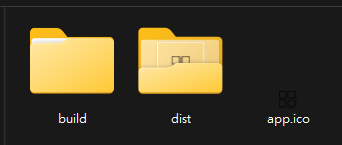
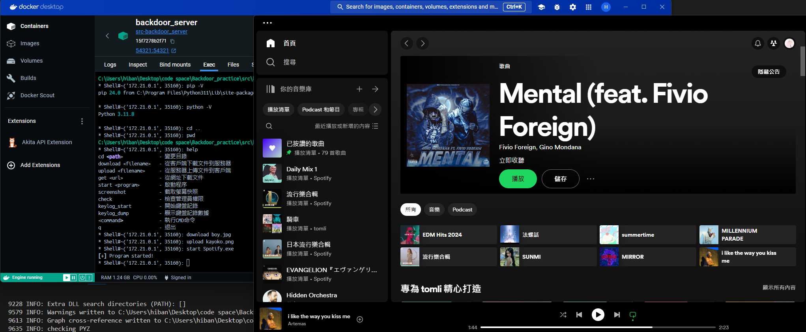

# 作業 5-1：Let's Coding - Step1 抄抄抄

李軒豪 11011240 資工三乙

## 簡介

這次作業基於老師的教學影片上的操作方法，稍作修改，首先使用 docker compose 架構虛擬環境 替代 Vbox，並且在程式碼中稍作修改，使輸出畫面更漂亮。

## Demo

*Pyinstaller 打包完後的結果*

---

*將 exe 檔分享給另一台電腦*

---

點開 exe 後， 會看到偽裝成圖片的檔案。

---

啟動 server 後，client 連線成功

然後這裡的字體有上色，是因為我在程式碼中使用 `rich` 這個套件，讓輸出畫面更漂亮。

---

這裡測試了幾個常見的指令，分別是 `pip -V`、`python -V`、`dir`，可以看到 Server 端收到了 Client 端的指令，並且正確執行。

---

由於 `windows` 系統下沒有 `pwd` 指令，所以這裡我使用了 `python` 的 `os` 模組，來取得當前目錄。

---

這裡測試了 `download` 指令，可以看到 Server 端成功接收到了 Client 端的檔案，並且存放在 Server 端的目錄下。

---

*上傳前的目錄*

*上傳後的目錄*

可以看到，`kayoko.png` 這個檔案，成功上傳到 Client 端。

---

*沒有管理員權限的情況下*

*有管理員權限的情況下*

這裡測試了 `check` 指令，可以看到現階段的使用者是否有管理員權限。

---

*執行 螢幕截圖指令*

*螢幕截圖*

這裡測試了 `screenshot` 指令，可以看到 Server 端成功接收到了 Client 端的螢幕截圖。

---

這裡測試了 `keylog_start` 與 `keylog_dump` 指令，可以看到 Server 端成功接收到了 Client 端的鍵盤輸入。

---

這裡測試了 `start` 指令，剛好 spotify 可以用 cmd 開啟 (Spotify.exe)，所以這裡我用 `start` 指令開啟了 spotify。

## 結論

在這次的作業中，我透過實際的編程與修改，成功構建了一個虛擬環境並實現了多項功能。透過使用 Docker Compose 取代 Vbox，我不僅簡化了環境的搭建過程，還提高了系統的可攜性與可重複使用性。此外，通過 `rich` 套件，我讓終端的輸出更加美觀，提升了用戶的操作體驗。

透過測試各種指令，包括文件操作、系統管理權限檢查、鍵盤記錄和螢幕截圖等，證明了我系統的穩定性與實用性。每一個功能的實現都體現了對知識的應用和對問題解決能力的鍛煉。

最後，本作業不僅加深了我對後門程式的理解，也激起我對後門程式設計的興趣，我會繼續深入學習，提高自己的技術水平(不犯法的狀況下)。