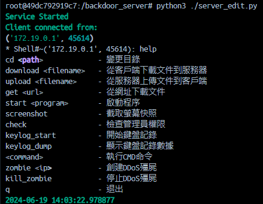
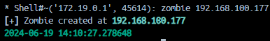
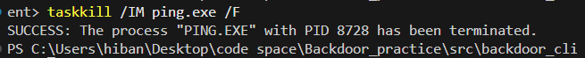
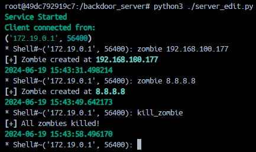
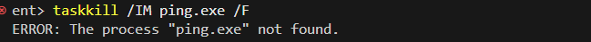

# 作業 5-3：Let's Coding - Step3 寫寫寫

李軒豪 11011240

## 更新內容

- 增加 DDos 攻擊
- 關閉所有 DDos 攻擊
- 增加指令執行結束時間

## Demo

這是新的介面，可以看到新增了兩個功能，分別是 `create_ddos` 和 `delete_ddos`。

建立一個 DDos 攻擊。

在宿主機上確認是否有發起 DDos 攻擊。

刪除所有的 DDos 攻擊。

在宿主機上確認是否有關閉 DDos 攻擊。

